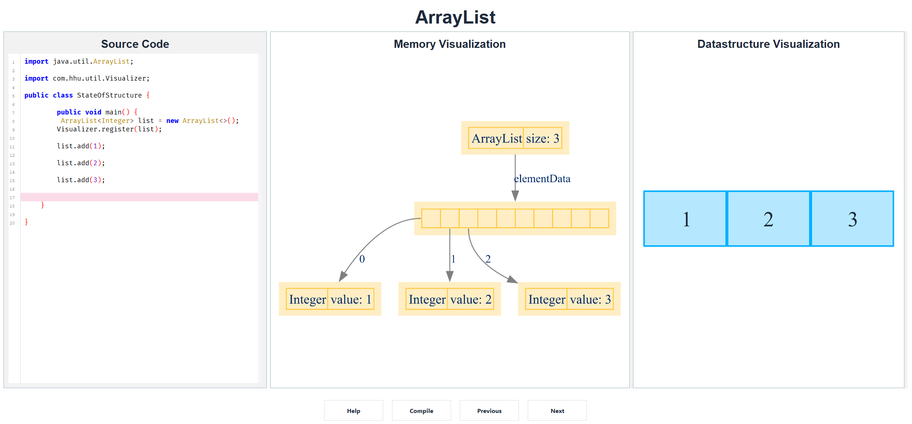
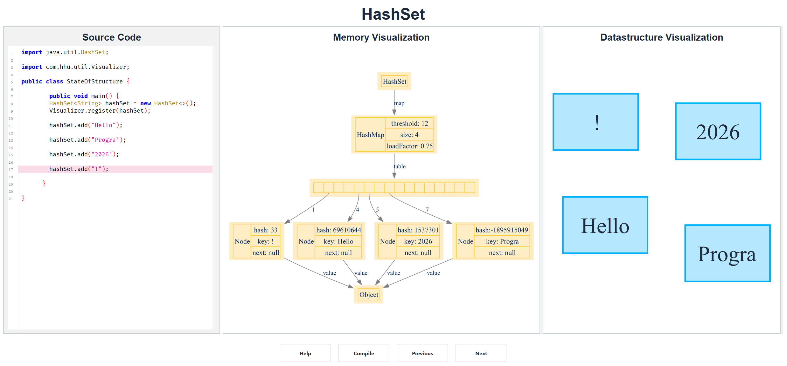
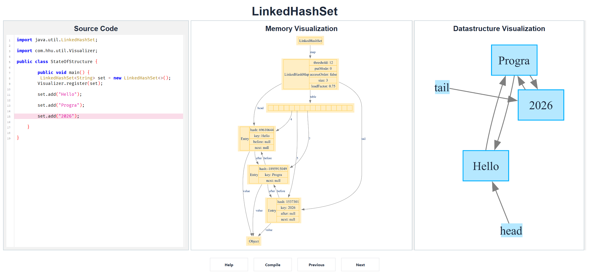
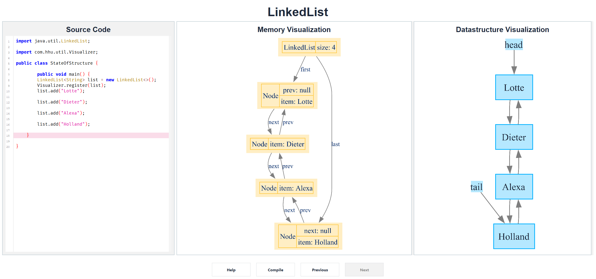
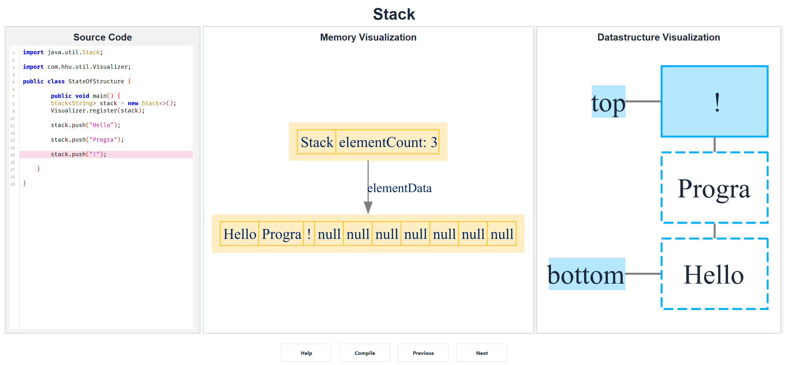
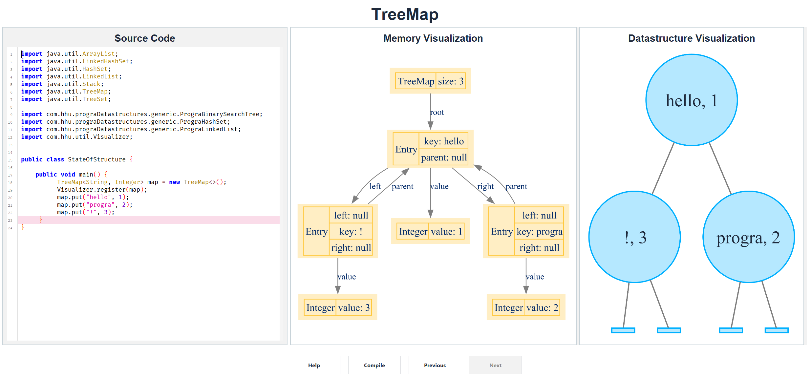
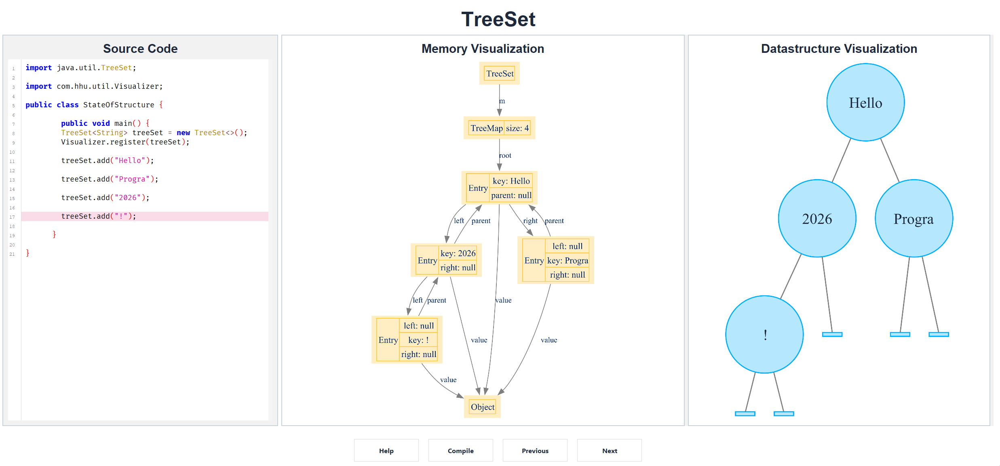
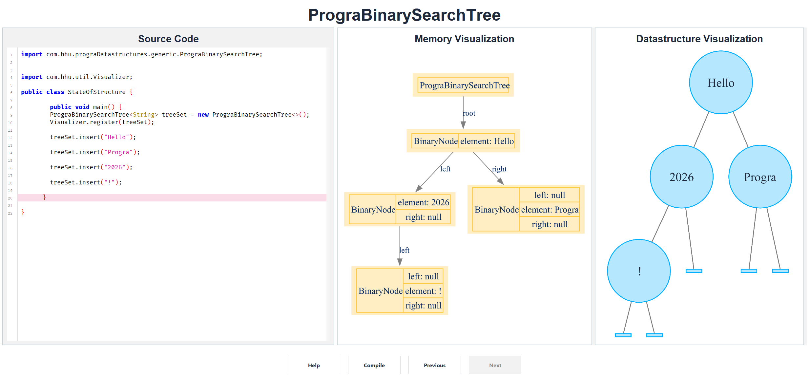
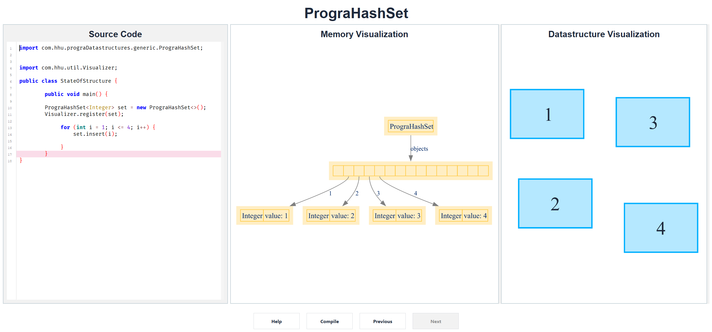
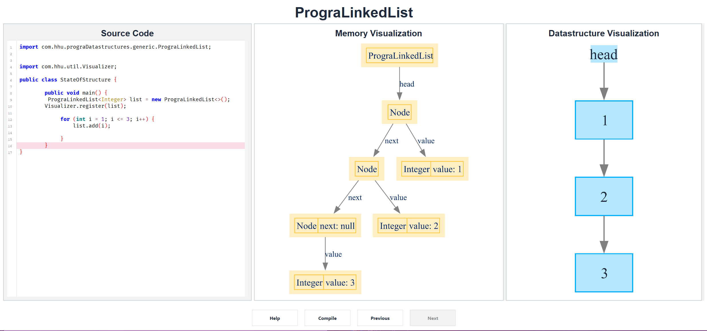

# StateOfStructure

**StateOfStructure** is a learning tool for computer science students who want to understand what data structures are doing while their code runs. Instead of only reading source code or final output, the tool shows a step-by-step visual history of a data structure as it changes.

It is especially useful in courses that teach algorithms, programming, memory models, or common collections such as stacks, lists, sets, maps, hash tables, and binary search trees.


## Requirements

Before running the project, install:

1. **A JDK that supports the configured Java version**  
   The project is configured with Maven compiler release `25`.
2. **Graphviz**  
StateOfStructure uses Graphviz to render visual representations of data structures. Install it from the official [Graphviz download page](https://graphviz.org/download/) and make sure the Graphviz executables are available on your system path.

## How the tool works

The workflow is simple:

1. The application starts with an editable Java example.
2. The example defines a class named `StateOfStructure` with a non-static `public void main()` method.
3. The code creates a supported data structure.
4. The data structure is registered with `Visualizer.register(...)`.
5. When the user clicks **Compile**, StateOfStructure compiles the Java code in a temporary workspace.
6. The tool automatically records the data structure after statements in the `main` method.
7. The interface shows each recorded state as a navigable step.
8. The **Previous** and **Next** buttons let students move through the execution history.

## Minimal example

```java
import java.util.Stack;
import com.hhu.util.Visualizer;

public class StateOfStructure {

    public void main() {
        Stack<Integer> stack = new Stack<>();
        Visualizer.register(stack);

        stack.push(1);
        stack.push(2);
        stack.pop();
    }
}
```

After compilation, the visualization shows how the stack changes after each operation.

## Supported data structures

StateOfStructure currently contains graph builders for these structures:

### Java standard library

- `ArrayList`
- `HashSet`
- `LinkedHashSet`
- `LinkedList`
- `Stack`
- `TreeMap`
- `TreeSet`

### Course-specific structures

- `PrograBinarySearchTree`
- `PrograHashSet`
- `PrograLinkedList`

## Running the application

### Windows

```powershell
.\mvnw.cmd clean compile exec:exec
```


### macOS / Linux

```bash
mvn clean compile exec:exec
```

## Running tests

### Windows

```powershell
.\mvnw.cmd clean install
```

### macOS / Linux

```bash
mvn clean install
```

## Build a packaged JAR

```bash
mvn clean package
```

The Maven Shade plugin creates a runnable shaded artifact during the package phase.

## How to write examples for the application

Use this structure:

```java
import com.hhu.util.Visualizer;

public class StateOfStructure {

    public void main() {
        // 1. Create a supported data structure.
        // 2. Register it.
        // 3. Mutate it with operations you want to understand.
    }
}
```

Important rules:

- The class must be named `StateOfStructure`.
- The method must be named `main`.
- The method must be `public void main()` and must **not** be static.
- Exactly one data structure should be registered for a clear visualization. If the class registers multiple data structures, the last registered data structure will be visualized.
- Call `Visualizer.register(yourDataStructure)` before the operations you want to inspect.

## User interface overview

- **Compile**: compiles the current Java code and rebuilds the recorded visualization.
- **Previous**: moves one step backward in the recorded state history.
- **Next**: moves one step forward in the recorded state history.
- **Help**: opens the in-application tutorial.
- **Mouse wheel on graph panels**: zooms the visualization.
- **Drag on graph panels**: pans the visualization.

## Project structure

```text
src/main/java/Main.java                         Application entry point
src/main/java/com/hhu/util/Visualizer.java      Static wrapper for Visualization class.
src/main/java/com/hhu/util/compiler/Compiler.java
                                                Compiles user code and injects recording calls
src/main/java/com/hhu/datastructureView/        Graph builders for supported data structures
src/main/java/com/hhu/ui/                       Swing user interface
src/main/resources/StateOfStructureDefault.txt  Default example loaded by the application
src/test/java/                                  Unit tests
Documentation.tex                               Project documentation
```

## Troubleshooting

### Graphs do not render

Check that Graphviz is installed correctly and that its executables are available from your terminal.

### Compilation says no Java compiler was found

Run the application with a JDK, not only a JRE.

### The application does not start in a terminal-only environment

StateOfStructure is a Swing desktop application and needs a graphical environment.

## Educational purpose

StateOfStructure is designed to support learning. It does not replace a textbook, lecture, or debugger. Instead, it gives students an interactive bridge between code and concept: each operation is connected to the visible state that it creates.


## Screenshots

### ArrayList



### HashSet



### LinkedHashSet



### LinkedList



### Stack



### TreeMap



### TreeSet



## Course-specific Structures

### PrograBinarySearchTree



### PrograHashSet



### PrograLinkedList


